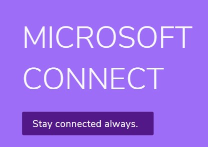
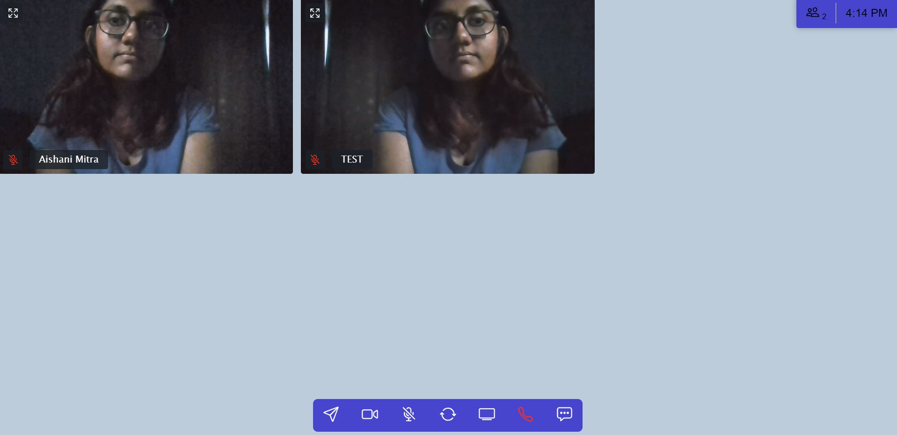
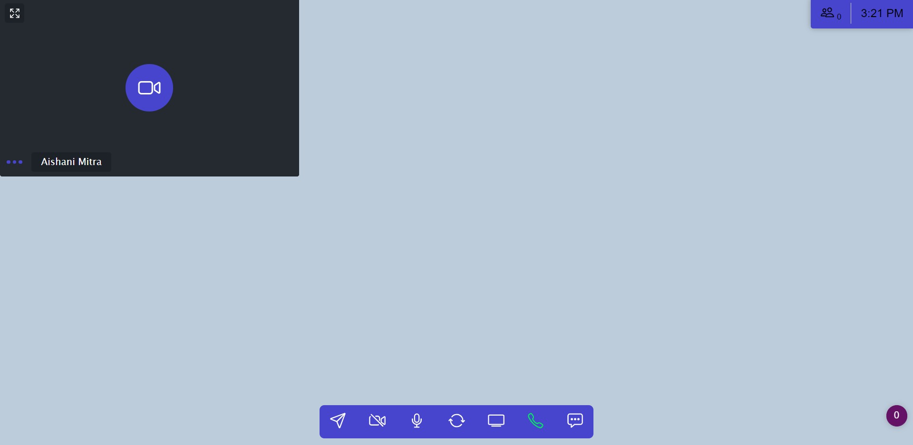
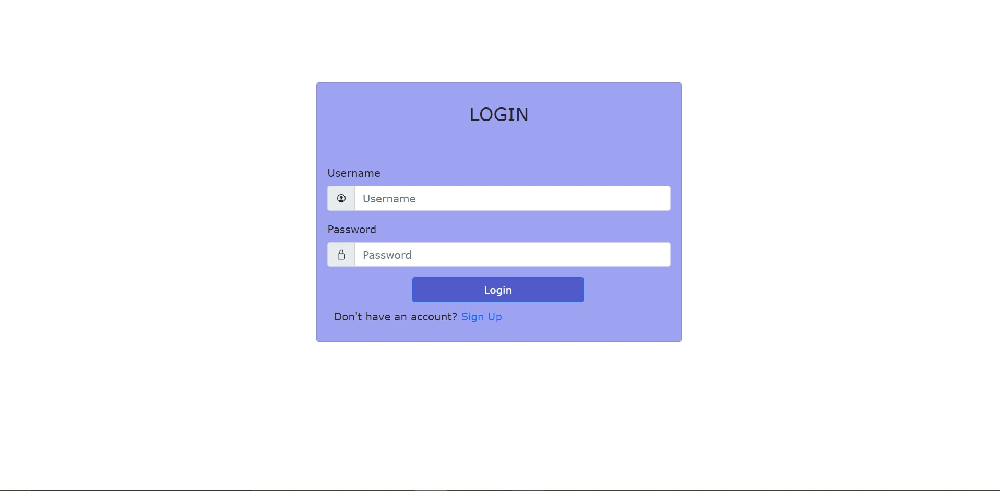
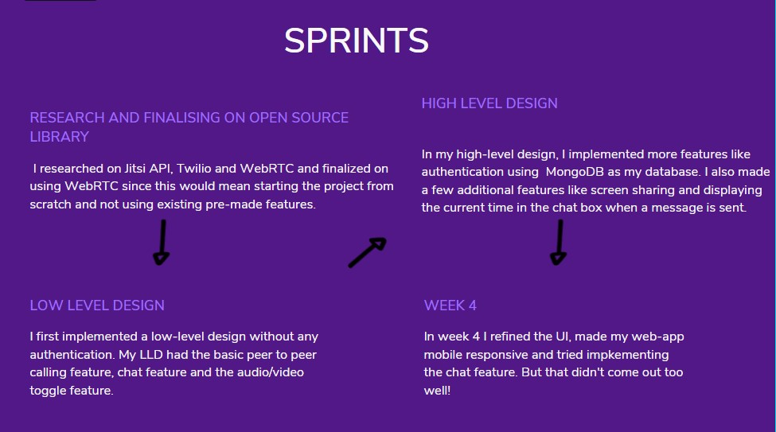

# Microsoft Connect

A microsoft teams clone web-app made under the Microsoft Engage Program 2021.  

## Steps to join call
- Click the link given under deployment. You will be redirected to the login page.
- For first time users, go to signup page and make an account. Use the username and password to login.
- Click on new meeting to start your own meeting or if you wish to join a pre-existing meeting, paste in the ID that was shared with you and enter the room.
- To join call, click on the green "Join Call" button. Only then you can video call with your friends or chat.
- To use two different accounts, open the app once from the normal browser and once from the incognito mode. You should be able to video call through two different accounts then.

## Deployment
Deployed on Heroku.
- #### View the app [here](https://microsoft-connect.herokuapp.com/).

## Video Submission
- #### View video [here](https://www.youtube.com/watch?v=r_xdPrjfzlA).

## Screenshots

##Features
- Peer to Peer video-calling feature
- User authentication using e-mail
- Normal in-call chatting feature 
- Audio and video toggle option
- Screen-sharing feature
- Fully responsive web-app

## Sprints 

## Libraries used
- [Peer JS for WebRTC connection](https://peerjs.com)
- [Socket IO](https://socket.io/)
- [UUIDv4 for getting unique IDs](https://www.npmjs.com/package/uuidv4)

## Frontend
- HTML
- CSS & SCSS

## Backend
- #### Server used : [Express JS](https://expressjs.com/)
- #### Database used : [MongoDB Atlas](https://www.mongodb.com/cloud/atlas)

