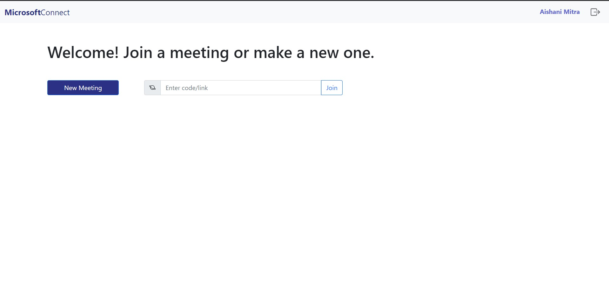

# Microsoft Connect

A microsoft teams clone web-app made under the Microsoft Engage Program 2021.  

## Screenshots

##Features
- Peer to Peer video-calling feature
- User authentication using e-mail
- Normal in-call chatting feature 
- Audio and video toggle option
- Screen-sharing feature
- Fully responsive web-app

## Sprints 

## Libraries used
- [Peer JS for WebRTC connection](https://peerjs.com)
- [Socket IO](https://socket.io/)
- [UUIDv4 for getting unique IDs](https://www.npmjs.com/package/uuidv4)

## Frontend
- HTML
- CSS & SCSS

## Backend
- #### Server used : [Express JS](https://expressjs.com/)
- #### Database used : [MongoDB Atlas](https://www.mongodb.com/cloud/atlas)

## Deployment
Deployed on Heroku.
- #### Link : 

